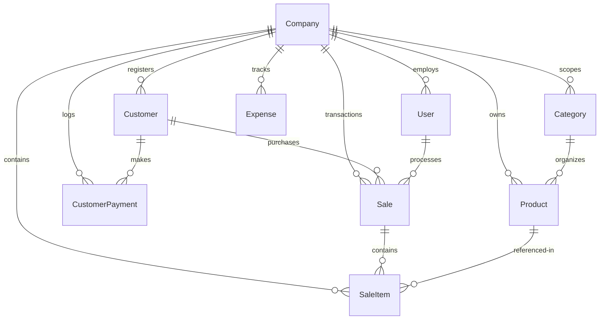

# Mnemos — Product Requirements Document (PRD)

## 🧠 Product Overview

**Product**: Mnemos — Multi-Tenant Inventory & Sales Management SaaS  
**Target**: Small to medium-sized retail businesses and multi-branch operations  
**Core Value**: A secure, flawless, and ultra-fast transactional memory bank for retail activities, featuring full multi-tenant data isolation, Point of Sale (POS) operations, inventory control, debtor/customer tracking, and rich visual performance analytics.  
**Platform**: Responsive Web App (optimized for both desktop registers and mobile inventory checks)

---

## 🎨 Design System: "Mnemos Craft"

We maintain a premium, editorial, high-contrast, black-and-white minimalist design system known as **Mnemos Craft**.

### Color Palette
```text
Primary:       #000000 (Pure Black)  - For primary headings, active borders, and buttons
Surface:       #F9F9FB (Off-white)   - For cards, table headers, and layout backgrounds
Border:        #E5E7EB (Light gray)  - For dividing elements cleanly
Text Primary:  #111827 (Near black)  - For body and prominent text
Text Muted:    #6B7280 (Gray)        - For descriptions and small labels
Accent:        #FF3B30 (Red/Orange)  - Used sparingly for credit sales, low-stock, or critical flags
Accent Soft:   #FEE2E2               - soft background for credit or critical badges
```

### Typography
- **Headings (Page & Section titles)**: Elegant editorial serif style.
  - Tailwind: `font-serif font-bold italic uppercase tracking-tighter`
- **Metadata and UI Labels**: High-contrast, wide-spaced monospace/sans-serif.
  - Tailwind: `text-[10px] uppercase tracking-[0.4em] font-bold opacity-60`
- **Body & Controls**: Strict, modern sans-serif stack (`Inter`, `system-ui`).

### Layout & Animations
- **Staggered Entries**: Grid cards and table rows render via Framer Motion with cubic-bezier transitions (`ease: [0.23, 1, 0.32, 1]`) and staggered delays (`staggerChildren: 0.05`) to feel buttery smooth and premium.
- **Micro-interactions**: Subtle hover scaling on buttons and row actions.
- **Page Transitions**: All page routing is wrapped in `<AnimatedPage>` to prevent rigid content snapping.

---

## 📐 Project Structure

```text
mnemos/
├── backend/
│   ├── prisma/             # Schema, migrations, seed, and data backfills
│   ├── src/
│   │   ├── controllers/    # Route controllers (request handlers)
│   │   ├── db/             # Prisma client & tenant isolation factory
│   │   ├── middleware/     # JWT authentication & role-based validation
│   │   └── routes/         # Express endpoint routing
├── frontend/
│   ├── src/
│   │   ├── components/     # Shared, reusable UI widgets
│   │   ├── hooks/          # Custom hooks (e.g. React Query hooks)
│   │   ├── pages/          # Full page layouts (POS, Customers, etc.)
│   │   ├── services/       # Axios API client connection
│   │   └── store/          # Zustand client-state stores (e.g. POS cart)
```

---

## 🗄️ Database Schema Specification

Below is the database representation defined in Prisma, designed with absolute multi-tenant constraints:



### Primary Entity Definitions

1. **Company (Tenant)**: The isolation boundary. Represents an individual business.
2. **User**: Credentials for team members linked to a Company, containing roles (`OWNER`, `MANAGER`, `STAFF`).
3. **Category**: Custom categories for inventory grouping. Unique per company/name.
4. **Product**: Individual items containing `sku` (company-unique index), `price` (Decimal), `cost` (Decimal), `stockLevel`, and `minStock`.
5. **Customer**: Tracks profiles, contact numbers, and optional `creditLimit` (Decimal).
6. **CustomerPayment**: Log of payments made by customers towards credit accounts or outstanding debts.
7. **Sale**: Standard POS transaction record containing `paymentMethod` (`CASH`, `CARD`, `TRANSFER`, `CREDIT`), `totalAmount` (Decimal), and detailed buyer links.
8. **SaleItem**: Individual lines in a sale record tracking quantity, price, and unit cost at the time of purchase.
9. **Expense**: Business operational expenditure log for complete financial bookkeeping.

---

## 🖼️ Feature Specifications

### 1. Secure Multi-Tenant Authentication
- **Registration**: Allows new business owners to create an account, which automatically initializes a brand new `Company` space (tenant context).
- **Login**: Issue secure JSON Web Tokens (JWT) containing encoded `userId`, `companyId`, and `role`.
- **Enforcement**: Token validation automatically instantiates a tenant-scoped Prisma client attached directly to `req.db`. Unscoped requests are permanently rejected.

### 2. Live Dashboard Analytics
- **Visuals**: Dynamic overview widgets with high-contrast layouts.
- **Charts**: Utilizes **ApexCharts** to display real-time sales trends, product popularity, and daily revenue statistics.
- **Key Metrics**: Instantly calculated cards for Total Sales, Net Margin, Expenses, and Outstanding Customer Debt.

### 3. High-Performance POS (Point of Sale)
- **Cart Management**: Real-time cart calculations using Zustand state. Supporting addition, removal, quantity increment/decrement, and inline price edits.
- **Payment Operations**: Supports Cash, Card, Transfer, and Credit.
- **Credit (Debt) Sales**: If "Credit" is selected, the sale must be attached to a registered `Customer`, and the customer's outstanding balance increases by the sale total.
- **Receipt Workflow**: Successful checkout displays a clean, minimalist modal printable using native thermal print settings (`window.print()`).

### 4. Inventory Management
- **Product Registry**: Full CRUD support for products including SKU validation.
- **Threshold Warnings**: Items whose `stockLevel` falls below `minStock` are highlighted with soft red warning alerts (`bg-accent-soft/30 text-accent`).
- **Category Matrix**: Company-level category tabs for effortless filter scopes.

### 5. Customer & Debt Management
- **Customer Ledger**: Track details, purchase logs, and credit limits.
- **Debt Tracking**: Easily identify debtors, view total unpaid credit sales, and log payments (`CustomerPayment`) to settle balances.

### 6. Reports & Audits
- **Insights**: Custom date range selection to audit sales volume, total product costs, gross margins, and operational expense offsets.

---

## ⚙️ Core Business & Isolation Logic

> [!IMPORTANT]
> **Tenant Scoping Enforcement**
> All write, read, and delete transactions are intercepted by the Prisma `$extends` query middleware. This middleware automatically appends `{ companyId }` parameters to all database interactions.
> Direct raw queries must utilize `req.db.$tenantId` to manually construct safe SQL.

> [!WARNING]
> **Decimal Calculations**
> Financial equations must never use generic JavaScript `Number` floating points for math-critical calculations. Convert raw database Decimals via `Number()` formatting strictly for display purposes. Settle all arithmetic calculations cleanly on the database or using precise operations.
